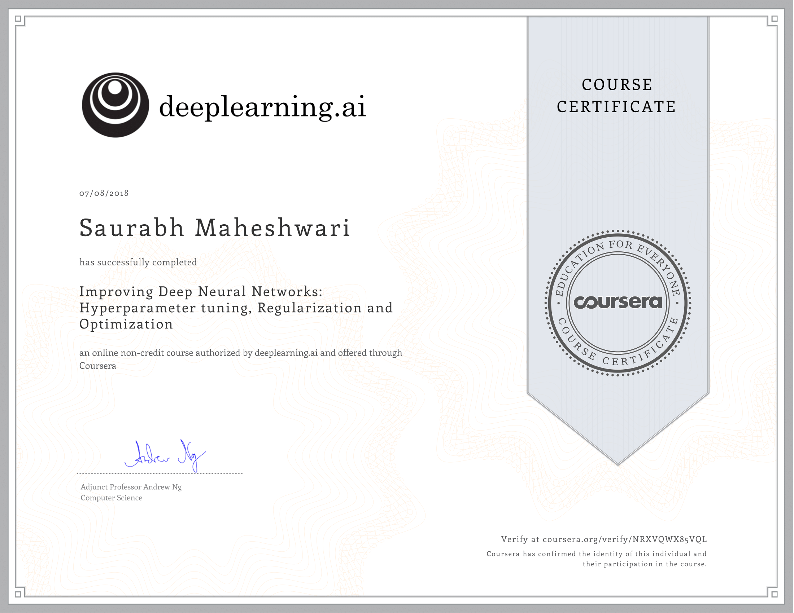
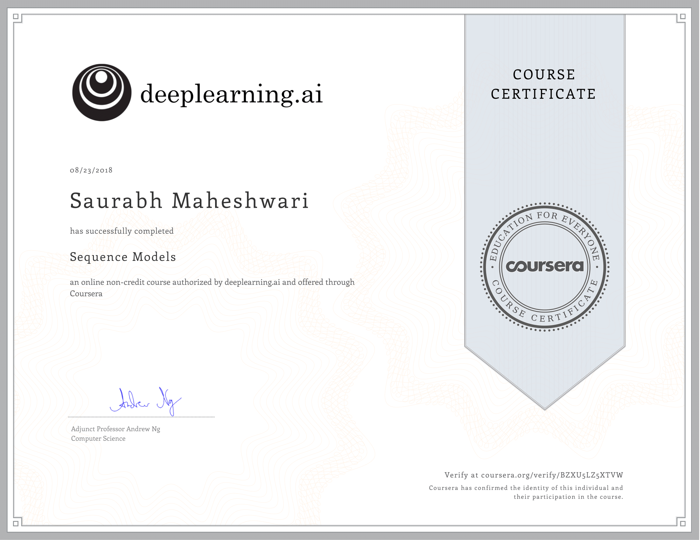
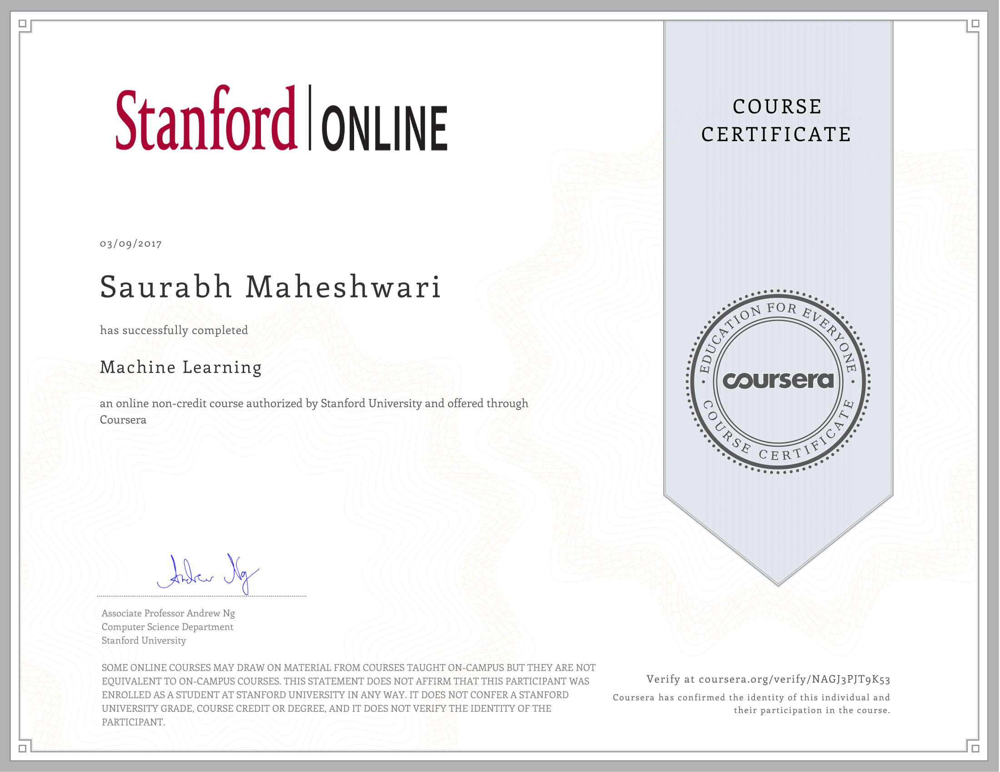
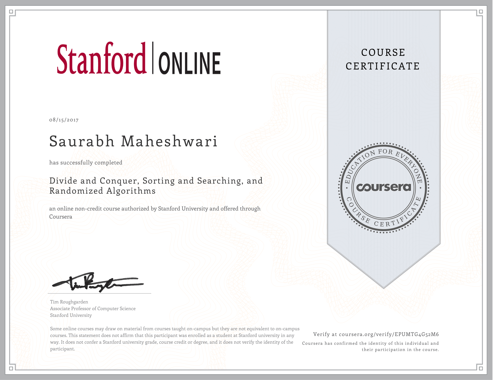
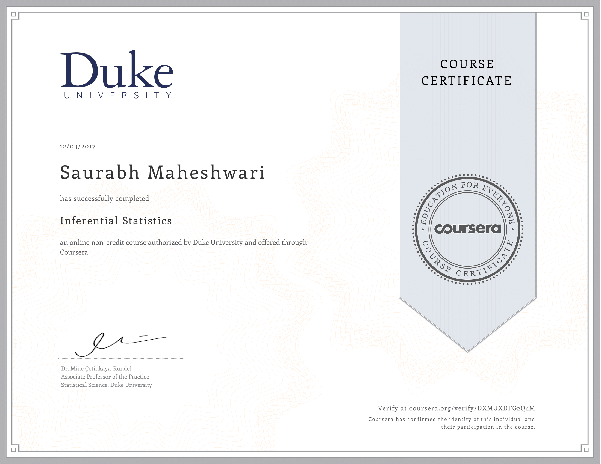
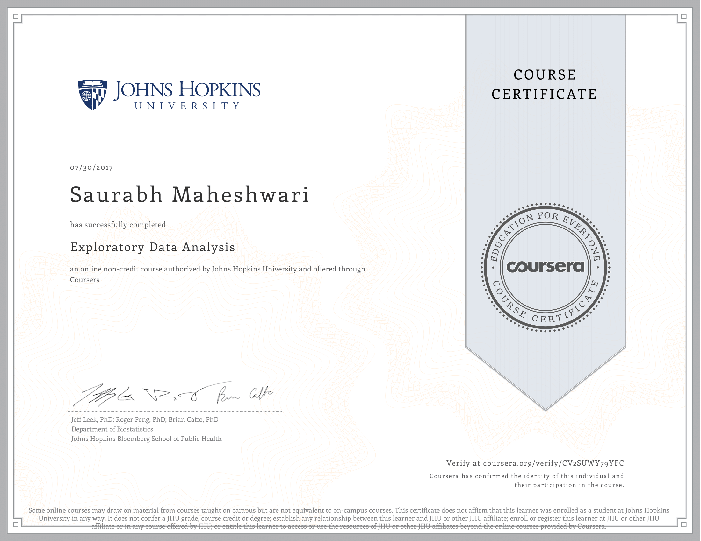
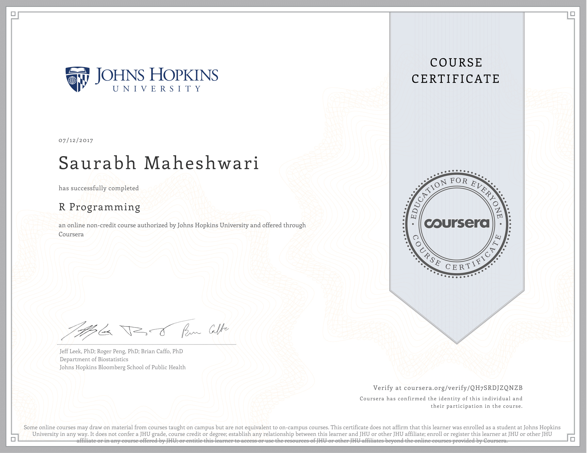

*Here are some of certificates I recieved for completing online courses*  

1.  **Deep Learning Specialization**  
    

2.  **Neural Networks and Deep Learning**  
    

3.  **Improving Deep Neural Networks: Hyperparameter Tuning,
    Regularization and Optimization**  
    

4.  **Structuring Machine Lerning Projects**
    

5.  **Convolutional Neural Networks**
    

6.  **Sequence Models**
    

7.  **Machine Learning**
    
8.  **Divide and Conquer, Sorting and Searching, and Randomized
    Algorithms** 

9.  **Inferential Statistics**
    

10. **Exploratory Data Analysis**
    

11. **R Programming**
    
