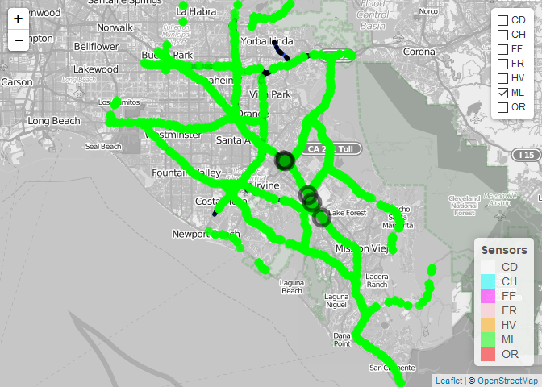

Directed Network Graph Formation
================
Saurabh Maheshwari
May 8, 2018

*Let the file load, graphs may take a while to appear*

### Objective

The aim of this project is to automate the process of directed network graph formation, i.e., creation of incidence matrix, node adjacency matrix,and map the sensors to appropriate links. The data used for creating the freeway network is obtained from open street maps, whereas, the data for sensors is obtained from PeMS. The results of the algorithm will be fed to the network sensor error estimation algorithm, that quantifies the erroneous sensors using network statistics.

### Major libraries used

**Osmar** - To import data from open street maps
**Leaflet**, **mapview**, **sp** - Mapping the network
**dplyr**, **plyr** - To manipulate data frames

### Methodology

**Creating the map required**
We start by downloading the bulk osm data for California (approx. 18GB). Next, using osmar library, we extract the required data using a bounding box, demarcating the latitude and longitude boundaries.
*bbox = corner\_bbox(-118.0042, 33.6363, -117.7226, 33.9194)*
Then extracting only the freeway information (links and nodes) from the resulting data, the following network is created:

``` r
# hw_lines contain extracted link data
# hw_nodes contain extracted node data
mapview(hw_lines) + mapview(hw_nodes, color = "black", cex = 1)
```

 
Looking closely, we see numerous nodes and links. To be exact, this graph consists of:

``` r
print(paste("number of nodes: ", length(unique(hw_nodes@data$id))))
```

    ## [1] "number of nodes:  12351"

``` r
print(paste("number of links: ", length(unique(hw_lines@data$id))))
```

    ## [1] "number of links:  2646"

The problem here is that most of the links contain more than two nodes, which would make the incidence matrix unnecessarily large. Thus, we extract the nodes that connect two links, and map them over the links. The updated map looks as follows:

``` r
# hp_req_sp contains only the required nodes
mapview(hw_lines) + mapview(hp_req_sp, color = "black", cex = 1)
```

 
Now, the number of nodes have decreased substantially to:

``` r
print(paste("number of nodes: ", length(unique(hp_req_sp@data$id))))
```

    ## [1] "number of nodes:  2973"

**Creating the incidence matrix**
To create the incidence matrix, each link was looked up for the first and last node incident on it, keeping in mind the direction. The rows represent nodes, whereas the columns represent links. +1 was assigned at the head and -1 to the tail of the link, all other entries to 0. The incidence matrix has a dimension of 2973 by 2640. Here, only first 10 rows and 5 columns of the incidence matrix are shown for illustration purpose.

``` r
LinkMat[1:10, 1:5]
```

    ##            3180574 3180801 3360383 3831350 4233409
    ## 122602715       -1       0       0       0       0
    ## 122927675        1       0       0       0       0
    ## 330636701        0      -1       0       0       0
    ## 1834951797       0       1       0       0       0
    ## 1834892407       0       0      -1       0       0
    ## 1599242164       0       0       1       0       0
    ## 772793241        0       0       0      -1       0
    ## 28933619         0       0       0       1       0
    ## 769420777        0       0       0       0      -1
    ## 25884951         0       0       0       0       1

**Assigning links to appropriate freeways**
The osm data does not explicitly mention about which freeway is a particular link part of. For example, the link with id "391666573" has the following tags attached to it:

``` r
hw$ways$tags[which(hw$ways$tags$id == "391666573"),]
```

    ##               id               k                     v
    ## 363757 391666573         bicycle                    no
    ## 363758 391666573    construction              widening
    ## 363759 391666573           FIXME Is construction done?
    ## 363760 391666573             hgv            designated
    ## 363761 391666573         highway              motorway
    ## 363762 391666573           lanes                     3
    ## 363763 391666573        maxspeed                55 mph
    ## 363764 391666573            name     Santa Ana Freeway
    ## 363765 391666573          oneway                   yes
    ## 363766 391666573             ref                   I 5
    ## 363767 391666573 source:maxspeed                  sign

Thus, for the freeway links a combination of "name" and "ref" tag was used to obtain the information about the freeway as follows.

``` r
Fwy = lapply(unique(NodeMat$id), function(x) {
  a = hp$ways$tags %>% filter(id == x)
  if (a$v[which(a$k == "highway")] == "motorway") {
  a = a %>% filter(k == "ref" | k == "name")
  }
})
Fwy = plyr::ldply(Fwy, as.data.frame)
FwynameList = as.vector(unique(Fwy$v[which(Fwy$k == "name")]))
FwynameList = cbind(
FwynameList,
c(
"CA 22",
"CA 55",
"CA 133 Toll",
"I 5",
"I 405",
"CA 133",
"CA 241 Toll",
"CA 91",
"CA 91",
"CA 73",
"CA 57",
"CA 91 Toll",
"CA 90",
"CA 73 Toll"
)
)
FwynameList_rep = FwynameList[match(Fwy$v, FwynameList[, 1]), 2]
Fwy$v[!is.na(FwynameList_rep)] = FwynameList_rep[!is.na(FwynameList_rep)]
Fwy = Fwy %>% group_by(id) %>% filter(row_number() == 1) %>% ungroup()
Fwy = Fwy[, -2]
Fwy = Fwy %>% mutate(Fwyno = as.numeric(grep("[0-9]",
unlist(
strsplit(as.character(v), split = " ")
),
value = TRUE))) %>%
arrange(Fwyno) %>% select(-v) %>% mutate(dir = rep(0, nrow(Fwy)))
```

Thus, a data frame named "Fwy" was created that contained the information about which freeway the links belonged to. First 5 rows are shown here for illustration purposes:

``` r
Fwy[1:5, 1:2]
```

    ## # A tibble: 5 x 2
    ##         id Fwyno
    ##      <dbl> <dbl>
    ## 1 13284964     5
    ## 2 23713195     5
    ## 3 27013988     5
    ## 4 27014060     5
    ## 5 27014062     5

**Adding ramps to the Fwy data frame**
So far, we only have freeway links assigned to the appropriate freeways. Now, we would like to add the immediate links that go off or on the freeway, aka ramps, to the data frame Fwy. This is done by checking for each node on the freeway segment, out of the links it is incident upon, which one is tagged as "motorway-link" in the osm data. If there is such a link, it was added to the Fwy data set with appropriate freeway values.
**Overlapping sensors over the network**
The sensor data is now used to add a layer over the existing graph to help visualize the complete network. Different types of sensors are grouped separately and can be viewed as per user's choice by clicking the check boxes. The legend shows the color used for each sensor type. Hovering upon the sensor, link or node highlights their IDs. By default, main line (ML) sensors are checked.

``` r
p = leaflet() %>% addProviderTiles(providers$OpenStreetMap.BlackAndWhite) %>%
  addPolylines(
  data = hw_lines,
  highlightOptions = highlightOptions(color = "red"),
  label = as.character(hw_lines$id)
  ) %>%
  addCircleMarkers(
  data = hp_req_sp,
  radius = 0.3,
  col = "black",
  label = ~ as.character(id)
  )
  cols = c("white", "cyan", "magenta", "pink", "orange", "green", "red")
  pal = colorFactor(cols, unique(MetaData$Type))
  purrr::walk(names(Meta_type), function(x) {
  dat = Meta_type[[x]]
  p <<- p %>%
  addCircleMarkers(
  data = dat,
  radius = 3,
  col = pal(x),
  popup = c(
  paste(
  as.character(dat$ID),
  as.character(dat$Type),
  as.character(dat$User_ID_1),
  as.character(dat$Name)
  )
  ),
  group = x,
  fillOpacity = 0.5,
  opacity = 0.8
  )
  })
  p = p %>% addLayersControl(overlayGroups = names(Meta_type),
  options = layersControlOptions(collapsed = FALSE)) %>%
  hideGroup(names(Meta_type)[-which(names(Meta_type) == "ML")]) %>%
  leaflet::addLegend(
  position = "bottomright",
  pal = pal,
  values = names(Meta_type),
  title = "Sensors"
  )
  p
```


**Mapping sensors to the appropriate links**
Currently, by visualization we can figure out the link that contains a particular sensor. As PeMS sensor metadata does not interact with the osm data, the link-sensor relation is unknown. We need to create an algorithm such that each sensor automatically gets mapped to the link using the geographical properties.
The algorithm for mapping sensors to the links is as follows:

1.  For each sensor location, extract all the links on the freeway segment in the direction sensor is installed
2.  For the nodes on each link, calculate 3 distances
    1.  Distance between the nodes (d1)
    2.  Distance between first node and sensor (d2)
    3.  Distance between last node and sensor
3.  Calculate d1 - (d2+d3), call it d4
4.  Calculate d4 for each link, and arrange d4 in ascending order
5.  The link for which d4 is smallest and lesser than a threshold (1e-4 in this case), assign it the sensor
6.  Repeat the above steps for each sensor location

Finally, the results are stored as a form of a list (linkId). For illustration purpose, 5 ML sensors on I-5, highlighted on the map, are shown below with the appropriate link chosen by the algorithm. One can verify the IDs by hovering above the links in the map and cross checking with the table that appears below.

``` r
sensors = c("1204701", "1204759", "1204823", "1205035", "1205060")
q = p %>% addCircleMarkers(lng = MetaData$Longitude[which(MetaData$ID %in% sensors)], lat = MetaData$Latitude[which(MetaData$ID %in% sensors)], color = "black", label = as.character(MetaData$ID[which(MetaData$ID %in% sensors)]))
sensor_data = linkId[[1]][which(linkId[[1]]$V2 %in% sensors), c(1,2)]
names(sensor_data) = c("Link ID", "Sensor ID")
sensor_data
```

    ##       Link ID Sensor ID
    ## 171 172241441   1204701
    ## 196  30086072   1204759
    ## 214  30086043   1204823
    ## 264  32144262   1205035
    ## 270  32144471   1205060

``` r
q
```

 

**Re-mapping ramp and freeway-freeway sensors**
Looking closely, one would figure out that the ramp sensors (OR/FR) are located on the freeways rather than ramps. Same for freeway-Freeway (FF) sensors. This was one of the tedious challenges I encountered in this project. But with a combination of a simple algorithm and manual work, the sensors were remapped. The details are omitted in this document. In the map below, all the remapped sensors are shown on their appropriate new links. 

 

**Creating the adjacency matrix**
To create adjacency matrix, for each link, nodes having 1 or -1 were searched in the incidence matrix. The cell corresponding to these nodes in the adjacency matrix was assigned 1, else 0. For illustration, first 10 rows and 10 columns of adjacency matrix are shown below:

``` r
Node_Node[1:10, 1:10]
```

    ##            122602715 122927675 330636701 1834951797 1834892407 1599242164
    ## 122602715          0         1         0          0          0          0
    ## 122927675          1         0         0          0          0          0
    ## 330636701          0         0         0          1          0          0
    ## 1834951797         0         0         1          0          0          0
    ## 1834892407         0         0         0          0          0          1
    ## 1599242164         0         0         0          0          1          0
    ## 772793241          0         0         0          0          0          0
    ## 28933619           0         0         0          0          0          0
    ## 769420777          0         0         0          0          0          0
    ## 25884951           0         0         0          0          0          0
    ##            772793241 28933619 769420777 25884951
    ## 122602715          0        0         0        0
    ## 122927675          0        0         0        0
    ## 330636701          0        0         0        0
    ## 1834951797         0        0         0        0
    ## 1834892407         0        0         0        0
    ## 1599242164         0        0         0        0
    ## 772793241          0        1         0        0
    ## 28933619           1        0         0        0
    ## 769420777          0        0         0        1
    ## 25884951           0        0         1        0

### Conclusion

The results of this project, namely, incidence matrix, adjacency matrix and link-sensor relation data frame were used for the network sensor error estimation algorithm. This project led to the application of the error estimation algorithm on large networks, which is expected to result in an important contribution to the field of sensor bias estimation.
