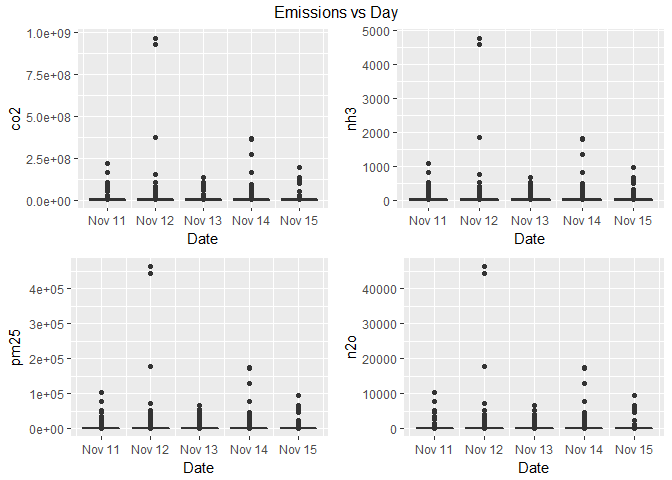
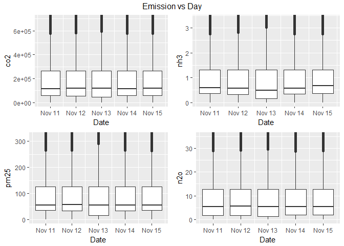
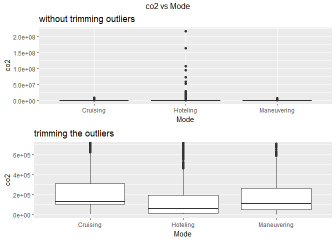
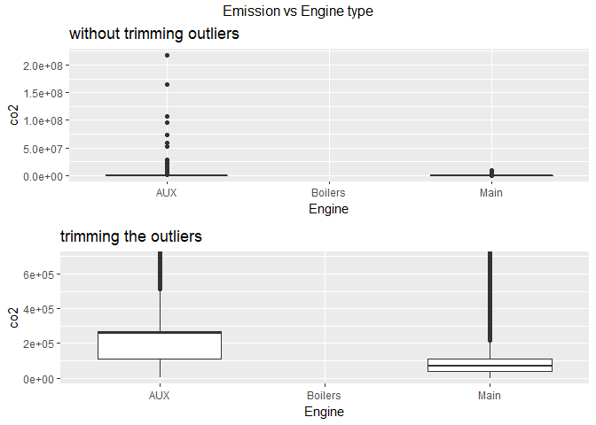
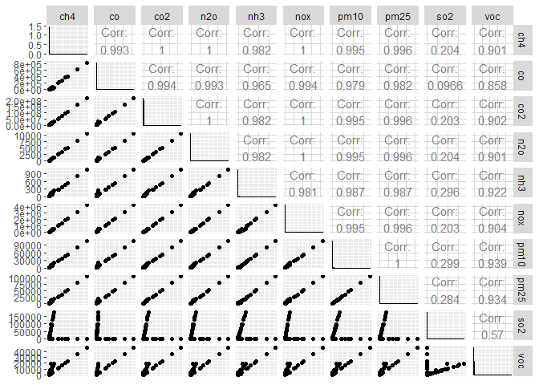
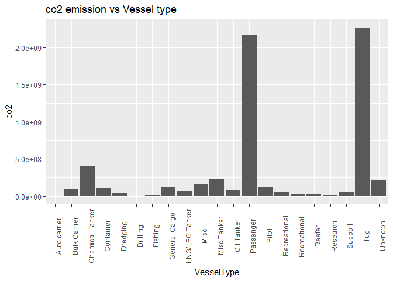
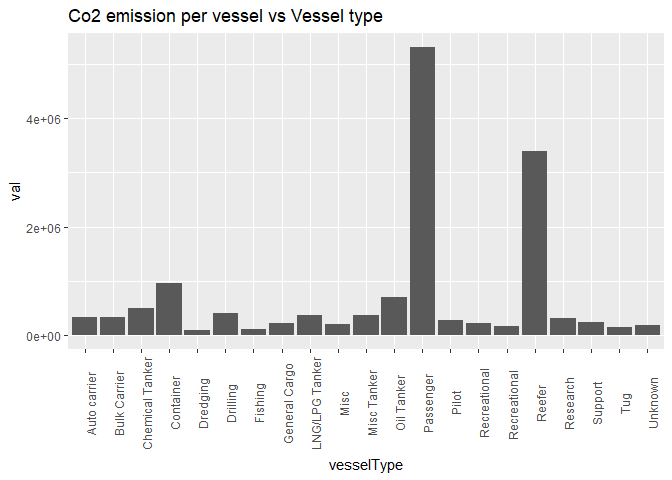

Houston Ship Channel: Part 1 - Data Analysis
================
Saurabh Maheshwari
May 9, 2018

*Jump to - <a href="https://github.com/sbhmaheshwari/Projects/blob/master/Shiny%20Leaflet%20integration/Interactive_mapping_part_2.md" target="_blank">Part 2: Interactive Mapping</a> *

### Objective

Create an interactive data query app to visualize the emissions caused by the vessels in the Houston ship channel based on the user specific inputs. The data contains emissions caused by around 900 vessels of 10 gases, recorded every 15 minutes for each vessel approximately for 5 consecutive days. Thus, the app basically summarizes the data by enhancing customized visualization. In this document, the data to be used for visualization has been analyzed by looking at trends between various variables. Later, in Part 2, the data has been mapped using the interactive shiny app.

### Major libraries used

**ggplot2**, **gridExtra**, **GGally** - Plotting
**dplyr**, **plyr** - Handling/Manipulating data frames

### Methodology

First we start by analyzing the data, to know about the variables before going for visualization.

``` r
load("HVData.RData")
print(paste("number of rows = ", nrow(HVData), ";", "number of features = ", ncol(HVData)))
```

    ## [1] "number of rows =  116530 ; number of features =  24"

Looking at the summary statistics:

``` r
summary(HVData)
```

    ##        X              RecordID        VesselIDtxt       VesselID    
    ##  Min.   :   2958   Min.   :  50249   Min.   :   10   Min.   :   10  
    ##  1st Qu.:2118270   1st Qu.:2496041   1st Qu.: 2039   1st Qu.: 2039  
    ##  Median :4202502   Median :4704092   Median : 2477   Median : 2477  
    ##  Mean   :4212443   Mean   :4818795   Mean   : 3092   Mean   : 3092  
    ##  3rd Qu.:6368706   3rd Qu.:7169998   3rd Qu.: 3144   3rd Qu.: 3144  
    ##  Max.   :8197675   Max.   :9932756   Max.   :16789   Max.   :16789  
    ##                                                                     
    ##     Latitude       Longitude       LandFlag     
    ##  Min.   :28.58   Min.   :-95.62   Land :  8939  
    ##  1st Qu.:29.31   1st Qu.:-95.09   Water:107591  
    ##  Median :29.47   Median :-94.96                 
    ##  Mean   :29.46   Mean   :-94.93                 
    ##  3rd Qu.:29.73   3rd Qu.:-94.74                 
    ##  Max.   :29.82   Max.   :-94.28                 
    ##                                                 
    ##              PositionTme     DurationInHours               VesselType   
    ##  11/14/2013 1:15:05:    23   Min.   :  0.01139   Tug            :68934  
    ##  11/14/2013 3:00:35:    22   1st Qu.:  0.24694   Misc           : 7511  
    ##  11/14/2013 4:15:34:    22   Median :  0.25000   Chemical Tanker: 6656  
    ##  11/15/2013 0:15:25:    22   Mean   :  0.54865   Unknown        : 6328  
    ##  11/11/2013 0:45:35:    21   3rd Qu.:  0.25528   Misc Tanker    : 5694  
    ##  11/12/2013 2:15:20:    21   Max.   :167.02140   General Cargo  : 4487  
    ##  (Other)           :116399                       (Other)        :16920  
    ##  VesselCatagory          Mode           Engine       Activity_kwh      
    ##  Min.   :1.00   Cruising   :19428   AUX    :59955   Min.   :      4.2  
    ##  1st Qu.:2.00   Hoteling   :15959   Boilers: 8980   1st Qu.:    750.0  
    ##  Median :2.00   Maneuvering:81143   Main   :47595   Median :    906.7  
    ##  Mean   :2.13                                       Mean   :   1415.6  
    ##  3rd Qu.:2.00                                       3rd Qu.:    939.0  
    ##  Max.   :3.00                                       Max.   :2332955.0  
    ##                                                     NA's   :721        
    ##       ch4                 co               co2           
    ##  Min.   :   0.000   Min.   :      0   Min.   :        0  
    ##  1st Qu.:   0.225   1st Qu.:    210   1st Qu.:    54886  
    ##  Median :   0.703   Median :    451   Median :   116272  
    ##  Mean   :   2.056   Mean   :   1188   Mean   :   337932  
    ##  3rd Qu.:   1.634   3rd Qu.:   1003   3rd Qu.:   264780  
    ##  Max.   :5972.365   Max.   :3702866   Max.   :967821678  
    ##  NA's   :8980                         NA's   :8980       
    ##       n2o                nh3                nox          
    ##  Min.   :    0.00   Min.   :   0.000   Min.   :       0  
    ##  1st Qu.:    1.74   1st Qu.:   0.327   1st Qu.:    1037  
    ##  Median :    5.45   Median :   0.565   Median :    2054  
    ##  Mean   :   15.94   Mean   :   2.081   Mean   :    6317  
    ##  3rd Qu.:   12.66   3rd Qu.:   1.311   3rd Qu.:    5113  
    ##  Max.   :46285.83   Max.   :4777.892   Max.   :18710940  
    ##  NA's   :8980                                            
    ##       pm10               pm25               so2           
    ##  Min.   :     0.0   Min.   :     0.0   Min.   :      0.0  
    ##  1st Qu.:    35.5   1st Qu.:    34.4   1st Qu.:      0.6  
    ##  Median :    57.5   Median :    55.5   Median :      2.2  
    ##  Mean   :   182.8   Mean   :   174.3   Mean   :    790.3  
    ##  3rd Qu.:   130.7   3rd Qu.:   126.6   3rd Qu.:      2.6  
    ##  Max.   :477789.2   Max.   :462858.3   Max.   :2028258.0  
    ##                                                           
    ##       voc           
    ##  Min.   :     0.00  
    ##  1st Qu.:    25.73  
    ##  Median :    41.78  
    ##  Mean   :   111.48  
    ##  3rd Qu.:    58.71  
    ##  Max.   :209032.80  
    ## 

Thus, out of all the variables, PositionTme, LandFlag, Mode and Engine are categorical. PositionTme describes the time, and would make more sense to get converted to as.POSIXct format for easy manipulation later on. We convert the format and add 2 new variables, Date and DateTime as follows to create a new data frame HVData\_1.

``` r
HVData_1 = HVData %>%
  mutate(
  DateTime = as.POSIXct(HVData$PositionTme, format = "%m/%d/%Y %H:%M:%S", tz = "GMT"),
  Date = as.Date(DateTime)
  )
```

As described in the summary some of the variables have NAs, lets filter out the number of NAs in each column.

``` r
sapply(HVData_1, function(x)sum(is.na(x)))
```

    ##               X        RecordID     VesselIDtxt        VesselID 
    ##               0               0               0               0 
    ##        Latitude       Longitude        LandFlag     PositionTme 
    ##               0               0               0               0 
    ## DurationInHours      VesselType  VesselCatagory            Mode 
    ##               0               0               0               0 
    ##          Engine    Activity_kwh             ch4              co 
    ##               0             721            8980               0 
    ##             co2             n2o             nh3             nox 
    ##            8980            8980               0               0 
    ##            pm10            pm25             so2             voc 
    ##               0               0               0               0 
    ##        DateTime            Date 
    ##               0               0

Thus, only Activity\_Kwh, ch4, co2 and n2o have missing data.
Next, we try to look at the trends in the data to get better insights. First, we create emission box plots with respect to days to understand the distribution of emissions over time. For illustration purposes, I only plot the trends for 4 gases, namely, co2, nh3, pm25 and n2o.

``` r
g1 = ggplot(data = HVData_1, aes(Date, co2)) + geom_boxplot(aes(group = Date), na.rm = TRUE)
g2 = ggplot(data = HVData_1, aes(Date, nh3)) + geom_boxplot(aes(group = Date), na.rm = TRUE)
g3 = ggplot(data = HVData_1, aes(Date, pm25)) + geom_boxplot(aes(group = Date), na.rm = TRUE)
g4 = ggplot(data = HVData_1, aes(Date, n2o)) + geom_boxplot(aes(group = Date), na.rm = TRUE)
grid.arrange(g1, g2, g3, g4, top = "Emissions vs Day")
```



In the plots above, because of large outliers, the box is depicted just as a line. Thus, next we plot the box plots by setting y limits.

``` r
g1 = ggplot(data = HVData_1, aes(Date, co2)) + geom_boxplot(aes(group = Date), na.rm = TRUE) + coord_cartesian(ylim = c(
  boxplot.stats(HVData_1$co2)$stats[1],
  boxplot.stats(HVData_1$co2)$stats[5] * 1.2
  ))
g2 = ggplot(data = HVData_1, aes(Date, nh3)) + geom_boxplot(aes(group = Date), na.rm = TRUE) + coord_cartesian(ylim = c(
  boxplot.stats(HVData_1$nh3)$stats[1],
  boxplot.stats(HVData_1$nh3)$stats[5] * 1.2
  ))
g3 = ggplot(data = HVData_1, aes(Date, pm25)) + geom_boxplot(aes(group = Date), na.rm = TRUE) + coord_cartesian(ylim = c(
  boxplot.stats(HVData_1$pm25)$stats[1],
  boxplot.stats(HVData_1$pm25)$stats[5] * 1.2
  ))
g4 = ggplot(data = HVData_1, aes(Date, n2o)) + geom_boxplot(aes(group = Date), na.rm = TRUE) + coord_cartesian(ylim = c(
  boxplot.stats(HVData_1$n2o)$stats[1],
  boxplot.stats(HVData_1$n2o)$stats[5] * 1.2
  ))
grid.arrange(g1, g2, g3, g4, top = "Emission vs Day")
```



The box plots above show that the distribution for each emission is almost constant over days for these gases. Though, for nh3, the mean level decreases on Nov 13. Next, as the distribution of the 4 gases is almost same over days, we pick co2 and Nov 11 for further analysis. Let's plot a box plot of co2 vs Mode before and after removing the outliers.

``` r
Nov_11_data = HVData_1 %>% filter(Date == "2013/11/11")
g4 = ggplot(data = Nov_11_data, aes(Mode, co2)) + geom_boxplot(na.rm = TRUE) + ggtitle("without trimming outliers")
g5 = ggplot(data = Nov_11_data, aes(Mode, co2)) + geom_boxplot(na.rm = TRUE) + coord_cartesian(ylim = c(
boxplot.stats(Nov_11_data$co2)$stats[1],
boxplot.stats(Nov_11_data$co2)$stats[5] * 1.2
)) + ggtitle("trimming the outliers")
grid.arrange(g4, g5, top = c("co2 vs Mode"))
```



Thus, one can see apparently that the vessels in Cruising mode creates most pollution and Hoteling the least. As Cruising vessels have higher speeds and load factor and Hoteling the least, this plot suggests that pollution in directly proportional to the speed and load factor of the vehicles. Next we would like to see the impact of engine type on emission.

``` r
g6 = ggplot(data = Nov_11_data, aes(Engine, co2)) + geom_boxplot(na.rm = TRUE) + ggtitle("without trimming outliers")
g7 = ggplot(data = Nov_11_data, aes(Engine, co2)) + geom_boxplot(na.rm = TRUE) + coord_cartesian(ylim = c(
boxplot.stats(Nov_11_data$co2)$stats[1],
boxplot.stats(Nov_11_data$co2)$stats[5] * 1.2
)) + ggtitle("trimming the outliers")
grid.arrange(g6, g7, top = "Emission vs Engine type")
```



Main engines are used to turn the ship's propeller and move the ship through the water, whereas, the AUX (auxiliary) engines smaller engines that drive electrical generators to provide power for the ship's electrical systems. The plots suggest that AUX engines create more co2 emissions as compared to Main. It's also seen that Boiler engines are not used on Nov 11, or the boiler engine co2 emissions are missing from the data. To look into it, lets check which engines are related to the missing co2 emission data.

``` r
table(Nov_11_data$Engine, !is.na(Nov_11_data$co2))
```

    ##          
    ##           FALSE  TRUE
    ##   AUX         0 11886
    ##   Boilers  1298     0
    ##   Main        0  9612

Thus, it is clear that 1298 missing values for co2 emissions are all for boiler engines on Nov 11. Lastly we try to visualize the correlation between different gasses. For that we plot the pair wise plot for all the gases on Nov 11. For this we first remove all the rows that have NA in any column.

``` r
Nov_11_data = Nov_11_data[complete.cases(Nov_11_data), ]
ggpairs(Nov_11_data[, 15:24]) + theme(
axis.title.x = element_blank(),
axis.text.x = element_blank(),
axis.ticks.x = element_blank()
)
```

 Thus, from the plot above it can be inferred that so2 and voc are the gasses that are least correlated with other gases. Apart from these two gases, all other gases show good correlation among each other. Lastly, we have a look at the co2 emissions vs vessel type. For this a bar plot is created for each vessel type.

``` r
ggplot(data = Nov_11_data, aes(VesselType, co2)) + geom_bar(stat = "identity") + theme(axis.text.x = element_text(angle = 90)) + ggtitle("co2 emission vs Vessel type")
```

 The figure shows that the tug vessels have the highest emissions, passenger are second. Though, it would be more interesting to plot the emissions per vessel for each category.

``` r
vessel_count = Nov_11_data %>% group_by(VesselType) %>% count() %>% ungroup()
emission_sum = Nov_11_data %>% group_by(VesselType) %>% summarise(sum(co2)) %>% ungroup()
emission_per_vessel = emission_sum$`sum(co2)`/vessel_count$n
ggplot(data = data.frame(vesselType = vessel_count$VesselType, val = emission_per_vessel), aes(vesselType, val)) + geom_bar(stat = "identity") + theme(axis.text.x = element_text(angle = 90)) + ggtitle("Co2 emission per vessel vs Vessel type")
```



Thus, Co2 emission per vessel is highest for passenger and then for reefer. Not surprisingly, the results are quite different as compared to cumulative emissions.

*Jump to - <a href="http://rpubs.com/Saurabhmaheshwari96/388130" target="_blank">Part 2: Interactive Mapping</a> *
