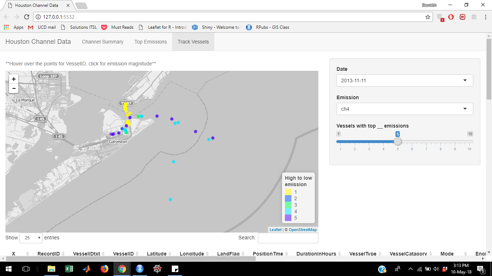

Houston Ship Channel: Part 2 - Interactive Mapping
================
Saurabh Maheshwari
May 10, 2018

*Jump to - <a href="https://github.com/sbhmaheshwari/Projects/blob/master/Shiny%20Leaflet%20integration/EDA_part_1.md" target="_blank">Part 1: Data Analysis</a> *

### Objective

The main objective of the project is to create an interactive data query app to visualize the emissions caused by the vessels in the Houston ship channel based on the user specific inputs. The data contains emissions caused by around 900 vessels of 10 gases, recorded every 15 minutes for each vessel approximately for 5 consecutive days. Thus, the app basically summarizes the data by enhancing customized visualization. In this document, the data has been interactively mapped using the shiny app. In part 1, the data to be used for visualization was analyzed by looking at trends between various variables.

### Major Libraries used

**Shiny** - For interactivity

**Leaflet**, **Leaflet.extras** - For mapping

**dplyr**, **plyr** - Handling/Manipulating data frames

### Outline of the app

The app consists of 3 pages.

1.  ***Page 1 - Channel Summary: *** Summarizes all the emission data as per user specific inputs. The following widgets are used for variables:
    1.  Select Box for Date, Vessel Type and Emission
    2.  Checkbox group for LandFlag, Vessel Category, Mode and Engine
    3.  Single checkbox to cluster


1.  ***Page 2 - Top Emissions: *** To map top emissions.
    1.  Select Box for Date
    2.  Checkbox group for Emissions. Thus more than one emission can be selected at a time
    3.  Sliders for the number of top emissions to consider
    4.  Single checkbox to cluster


1.  ***Page 3 - Track Vessels:*** To track the vessels causing top emissions.
    1.  Select Box for Date and Emission
    2.  Sliders for the number of top emissions to consider



### Methodology

To create the interactive app, firstly, a new data set has been created by adding 2 new variables Date and DateTime. Then, the new data set was split w.r.t date to create a list object, where each element of the list is a data frame containing emission data on a particular day.

``` r
load("HVData.RData")
# Create new columns containing Date
HVData_1 = HVData %>%
  mutate(
    DateTime = as.POSIXct(HVData$PositionTme, format = "%m/%d/%Y %H:%M:%S", tz = "GMT"),
    Date = as.factor(as.Date(DateTime))
  )
```

    ## Warning: package 'bindrcpp' was built under R version 3.4.2

``` r
# Create a list wrt Dates
Datefac = levels(HVData_1$Date)
emission_Date = split(HVData_1, HVData_1$Date)
names(emission_Date) = Datefac
emission_Date = lapply(emission_Date, function(x) {
  x %>% arrange(DateTime) %>% select(-Date)
})
```

Next, we create user interface object using Navbar Pages. This section specifies how does the app looks. The code for ui has been given below:

``` r
ui = navbarPage(
  "Houston Channel Data", # Title of the app
# Creating first page
  tabPanel(
    "Channel Summary", # Title of first page
    sidebarLayout(     # Creating the side bar
      position = "right",
      sidebarPanel(
        selectInput(  # Selecting Dates 
          "Date",
          label = "Date",
          choices = names(emission_Date),
          selected = names(emission_Date)[1]
        ),
        checkboxGroupInput( # Selecting LandFlag
          "LandFlag",
          label = "LandFlag",
          choices = list("Land", "Water"),
          selected = c("Land", "Water"),
          inline = TRUE
        ),
        selectInput( # Selecting Vessel Type
          "VesselType",
          label = "Vessel Type",
          choices = levels(HVData$VesselType),
          selected = "Passenger"
        ),
        checkboxGroupInput( # Selecting Vessel category
          "VesselCat",
          label = "Vessel category",
          choices = list(
            "category 1" = 1,
            "category 2" = 2,
            "category 3" = 3
          ),
          selected = c(1, 2, 3),
          inline = TRUE
        ),
        checkboxGroupInput( # Selecting Mode
          "Mode",
          label = "Mode",
          choices = levels(HVData$Mode),
          selected = levels(HVData$Mode),
          inline = TRUE
        ),
        checkboxGroupInput( # Selecting Engine
          "Engine",
          label = "Engine",
          choices = levels(HVData$Engine),
          selected = levels(HVData$Engine),
          inline = TRUE
        ),
        selectInput( # Selecting Emission
          "Emission",
          label = "Emission",
          choices = names(HVData)[15:24],
          selected = "ch4"
        ),
        # Whether cluster or not?
        checkboxInput("Cluster", label = strong("Cluster"), value = TRUE) 
      ),
      mainPanel( # Specifying the outputs to be shown in the page one main panel
        helpText("**Hover over the points for emission magnitude**"),
        leafletOutput("HoustonCh", height = "450px"),
        dataTableOutput("d1")
      )
    )
  )
  ,
## Creating second page
  tabPanel(
    "Top Emissions", # Title of the second page
    sidebarLayout(
      position = "right",
      sidebarPanel(
        selectInput( # Selecting date
          "TopDate",
          label = "Date",
          choices = names(emission_Date),
          selected = names(emission_Date)[1]
        ),
        checkboxGroupInput( # Selecting the emissions
          "TopEmission",
          label = "Emission",
          choices = names(HVData)[15:24],
          selected = "ch4",
          inline = TRUE
        ),
        sliderInput( # Selecting how many top emissions to show
          "TopNumber",
          label = "Show Top:",
          min = 1,
          max = 10,
          value = 1,
          step = 1
        ),
        # Whether to cluster or not?
        checkboxInput("TopCluster", label = strong("Cluster"), value = TRUE)
      ),
      mainPanel( # Specifying page two main panel
        helpText("**Hover over the points for magnitude, click for emission name**"),
        leafletOutput("TopEms", height = "450px"),
        dataTableOutput("Data"),
        textOutput("x")
      )
    )
  ),
## Creating third page
  tabPanel(
    "Track Vessels", # Title for the third page
    sidebarLayout(
      position = "right",
      sidebarPanel(
        selectInput(
          "TrackDate", # Selecting date
          label = "Date",
          choices = names(emission_Date),
          selected = names(emission_Date)[1]
        ),
        selectInput( 
          "TrackEmission", # Selecting emissions
          label = "Emission",
          choices = names(HVData)[15:24],
          selected = "ch4"
        ),
        sliderInput( # Selecting how many top emission vessles to show
          "TrackNo",
          label = "Vessels with top __ emissions ",
          min = 1,
          max = 10,
          step = 1,
          value = 5
        )
      ),
      mainPanel( # Specifying page three main panel
        helpText("**Hover over the points for VesselID, click for emission magnitude**"),
        leafletOutput("TrackShips", height = "450px"),
        textOutput("TrackX"),
        dataTableOutput("TrackData")
      )
    )
  )
)
```

Next, we create the server function. This section specifies what does the app show. The code for server is provided below:

``` r
server = function(input, output) {
  #Creating the outputs for main panel for first page
  Data_mod = reactive({
  # Creating new data frame as per user selection
  n = which(names(emission_Date) == input$Date)
  emission_Date[[n]] %>% filter(
  LandFlag %in% input$LandFlag,
  VesselType == input$VesselType,
  VesselCatagory %in% input$VesselCat,
  Mode %in% input$Mode,
  Engine %in% input$Engine
  )
  })
  
  map = reactive({
  # Creating map layer
  leaflet(Data_mod()) %>% addProviderTiles(providers$OpenStreetMap.BlackAndWhite)
  })
  #output$d1 = renderDataTable({Data_mod()})
  output$HoustonCh = renderLeaflet({
  # Creating the map output
  ngas = which(names(Data_mod()) == input$Emission) #column number of emission selected
  minD = min(Data_mod()[, ngas])
  maxD = max(Data_mod()[, ngas])
  # Creating the palette for coloring the points
  pal = colorNumeric(c("#ff8080", "#000000"), seq(minD, maxD, length = 100))
  map() %>%
  addHeatmap(
  # Adding heat map to the map
  intensity = Data_mod()[, ngas],
  # specifying the intensity
  radius = 30,
  # specifying radius
  gradient = "Blues",
  # specifying the gradient of heat
  group = "Heat",
  # assigning the layer to a group
  blur = 20 # assigning blur
  ) %>%
  addCircleMarkers(
  # Adding circle markers
  radius = 1,
  # radius of circles
  label = as.character(Data_mod()[, ngas]),
  # what label to show when hovered upon
  color = pal(Data_mod()[, ngas]),
  # color
  group = "Marker",
  # assigning to a group
  opacity = 0.5,
  # defining the opacity
  clusterOptions = if (input$Cluster) {
  markerClusterOptions() # Cluster or not depending upon user choice
  }
  ) %>%
  leaflet::addLegend(
  # adding the legend
  "bottomright",
  pal = pal,
  values = Data_mod()[, ngas],
  title = "Markers<br>w/o Cluster"
  ) %>%
  addLayersControl(
  # adding layer control
  overlayGroups = c("Heat", "Marker"),
  options = layersControlOptions(collapsed = FALSE)
  ) %>%
  hideGroup("Heat")
  })
  
  
  #---------------------------------------------------------------------------------------
  # Creating the main panel output for page two
  Data_mod2 = reactive({
  # Creating a new data frame as per user selection
  nTop = which(names(emission_Date) == input$TopDate) # which list element number?
  xTop = which(names(HVData) %in% input$TopEmission) # which emission column number?
  d = lapply(xTop, function(x) {
  #creating a list w.r.t emissions
  emission_Date[[nTop]] %>%
  arrange(desc(.[[x]])) %>% slice(1:input$TopNumber) %>%
  mutate(magnitude = .[[x]], gas = names(HVData)[x]) %>%
  select(1:14, magnitude, gas)
  })
  plyr::ldply(d, data.frame) # combine list to form a data frame
  })
  #output$x = renderText({class(Data_mod2()[,1])})
  mapTop = reactive({
  # creating map layer
  leaflet(Data_mod2()) %>% addProviderTiles(providers$OpenStreetMap.BlackAndWhite)
  })
  output$Data = renderDataTable({
  # Creating data table output
  Data_mod2()
  })
  output$TopEms = renderLeaflet({
  # Creating map output
  # Creating color palette for emissions
  palTop = colorFactor(topo.colors(10), names(HVData)[15:24])
  mapTop() %>%
  addCircleMarkers(
  # adding circle markers
  label = as.character(Data_mod2()[, "magnitude"]),
  # what label to how when hovered upon
  popup = as.character(Data_mod2()[, "gas"]),
  # what message to popup when clicked upon
  color = palTop(Data_mod2()[, "gas"]),
  # color
  radius = 2,
  # radius
  opacity = 0.7,
  # opacity of color
  clusterOptions = if (input$TopCluster) {
  markerClusterOptions() # show cluster or not as per user selection
  }
  ) %>%
  leaflet::addLegend(
  # adding legend
  position = "bottomright",
  pal = palTop,
  values = as.character(Data_mod2()[, "gas"]),
  title = "Markers<br>w/o Cluster"
  )
  
  })
  #--------------------------------------------------------------------------------------
  # Creating main panel output for page three
  Data_mod3 = reactive({
  # Creating a new data frame as per user selection
  nTrack = which(names(emission_Date) == input$TrackDate) # which list element number ?
  xTrack = which(names(HVData) %in% input$TrackEmission) # which emission column number?
  # Create a vector of Vessel Ids as per the number of top emission vessels required
  d = emission_Date[[nTrack]] %>% arrange(desc(.[[xTrack]])) %>%
  slice(1:input$TrackNo) %>% select(VesselID)
  df = lapply(d$VesselID, function(x) {
  # Create a list wrt Vessel IDs
  emission_Date[[nTrack]] %>%
  filter(VesselID == x)
  })
  plyr::ldply(df, data.frame) # Merging list into a data frame
  
  })
  output$TrackData = renderDataTable({
  # Creating data table output
  Data_mod3()
  })
  mapTrack = reactive({
  # Creating map layer
  leaflet(Data_mod3()) %>% addProviderTiles(providers$OpenStreetMap.BlackAndWhite)
  })
  output$TrackShips = renderLeaflet({
  # Creating the map output
  # what if the vessels are less than the number of vessel track input selected by user?
  mTrack = min(input$TrackNo, length(unique(Data_mod3()[, "VesselID"])))
  # Creating palette for color
  palTrack = colorFactor(topo.colors(mTrack), as.factor(Data_mod3()[, "VesselID"]))
  mapTrack() %>%
  addCircleMarkers(
  # adding circle markers
  label = as.character(Data_mod3()[, "VesselID"]),
  # what label to show when hovered upon
  popup = as.character(Data_mod3()[, input$TrackEmission]),
  # what popup to show when clicked
  radius = 2,
  # radius
  color = palTrack(Data_mod3()[, "VesselID"]) # color
  ) %>%
  leaflet::addLegend(
  # adding legend
  position = "bottomright",
  colors = palTrack(unique(Data_mod3()[, "VesselID"])),
  labels = as.character(1:mTrack),
  title = "High to low<br>emission"
  )
  })
}
```

The last section is for calling the app, that integrates ui and server sections and run the apps. The function is as below:
*shinyApp(ui = ui, server = server)*

*Jump to - <a href="http://rpubs.com/Saurabhmaheshwari96/388114" target="_blank">Part 1: Data Analysis</a> *
